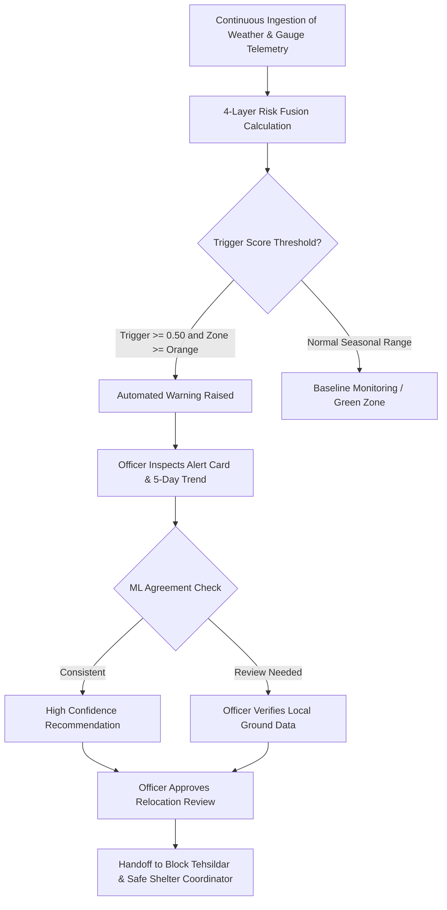

# PUNARVAAS — Operational & Evaluation Workflow Guide

This document specifies the operational lifecycle for State Disaster Management Authority (SDMA) officers and provides a step-by-step walkthrough for hackathon judges evaluating the PUNARVAAS decision-support system.

---

## Part 1: SDMA Official Daily Operating Procedure

### 1. Shift Handover & Baseline Check
1. Upon logging in, the duty officer checks the **Persistent Status Bar** at the top of the screen:
   - Number of active alerts in **RED**, **ORANGE**, and **YELLOW**.
   - Verified count of monitored districts (Puri, Kendrapara, Ganjam, Kandhamal).
   - Time of last data synchronization.
2. Review the **Overview Tab**:
   - Confirm baseline seasonal conditions.
   - Inspect the **Active Alert Ticker** for recent trigger escalations.

### 2. Alert Assessment & Triage (Alerts & Warnings Tab)
1. Switch to the **Alerts & Warnings Tab**.
2. Active warnings are grouped by severity with color-coded left borders:
   - **RED Alerts**: Composite score &ge; 0.75 and Acute/Elevated trigger. Immediate action required.
   - **ORANGE Alerts**: Composite score 0.50–0.74 and Acute/Elevated trigger. Short-term readiness.
   - **YELLOW Alerts**: Medium-term monitoring.
3. Click an alert card to expand its diagnostics:
   - Inspect the **5-Day Trigger Trend Progression** chart to observe if rainfall or river levels are climbing rapidly or stabilizing.
   - Review the **Deterministic Section 14 Template**:
     > `"{SEVERITY} ALERT — {hazard_type} risk, {location}. {trigger_description}. Composite risk score: {score} ({zone} zone, trend: {trigger_trend}). Recommended action: {urgency_tier}."`
   - Check the **ML Agreement Indicator**:
     - **Consistent**: Statistical model confirms rule-based score.
     - **Review Needed**: Discrepancy &gt; 0.15. Officer must check local terrain factors.
4. Click **"Recommend relocation review"** to escalate the settlement to the Relocation Planning roster.

### 3. Spatial Analysis (Live Map Tab)
1. Navigate to the **Live Map Tab**.
2. Filter by district (e.g., *Kendrapara*) or hazard (e.g., *River Basin Flood*).
3. Click on individual settlement markers to inspect the **4-layer score breakdown bar chart** and nearest shelter distance.

### 4. Shelter Carrying Capacity Verification (Carrying Capacity Tab)
1. Navigate to the **Carrying Capacity Tab**.
2. Review the district balance:
   - Sum of at-risk population in Red + Orange habitations vs available shelter capacity.
   - Verify that certified multipurpose cyclone shelters and high-plinth relief halls have adequate capacity surplus.

---

## Part 2: Hackathon Judge Demonstration Walkthrough

Follow these steps to demonstrate the full depth, responsiveness, and safety constraints of PUNARVAAS:

### Step 1: Launch Judge Demo Mode (1-Click Evaluation)
1. On the **Overview** or **Alerts & Warnings** tab, click the **[Judge Demo Mode]** button in the top navigation bar.
2. **What Happens Automatically**:
   - The backend applies the pre-cached **Baitarani River Flood Surge** scenario (inspired by the Dikhow River flood backtest).
   - River levels surge from 92.20m to 93.88m, crossing the CWC Danger Level (92.40m) and approaching the Highest Flood Level (94.35m).
   - Affected settlements in Kendrapara flip from **ORANGE to RED** with an **ACUTE** trigger trend.
   - The UI automatically navigates to the **Alerts & Warnings** tab and expands the lead RED alert card.
   - A pulsing simulation banner appears across the top stating: *"Simulation Active: Baitarani River Flood Surge (Orange → Red Escalation) · Pre-cached evaluation state (Zero external API calls)"*.

### Step 2: Evaluate Explainable AI (XAI) & Model Diagnostics
1. Examine the expanded alert card:
   - Note the **5-day trigger chart** showing the steep surge toward 100% trigger intensity.
   - Note the **Decision Model Diagnostics** displaying both the rule score and the `scikit-learn` Logistic Regression output.
   - Note the top driving factors identified by the trained model (e.g., Near-term Trigger Intensity, Static Hazard Susceptibility).

### Step 3: Test Scenario Switching
1. In the **Alerts & Warnings** tab, use the **"Simulate scenario"** dropdown:
   - Select **"Cyclone Landfall Escalation (Puri Coast)"**: Watch coastal habitations escalate under Extremely Severe Cyclonic Storm classification.
   - Select **"Kandhamal Hill Saturation (195mm Saturation)"**: Watch western hill habitations breach the GSI 150mm single-day trigger.
   - Select **"Baseline Seasonal State"**: Restores normal seasonal monitoring.

### Step 4: Verify System Constraints
1. **No Cloudburst in Odisha**:
   - Go to the **Habitation Directory** tab.
   - Filter by District: *Puri*, *Kendrapara*, *Ganjam*, or *Kandhamal*.
   - Filter by Hazard: *Cloudburst*.
   - Verify that **0 habitations match**. (Cloudburst is strictly confined to the illustrative non-Odisha demonstration set).
2. **Strict Color Usage**:
   - Notice that severity colors (`#C13F3F` Red, `#D97A2E` Orange, `#E0B33C` Yellow, `#3F8F5F` Green) appear **only** on zone tags, severity badges, and map markers. General buttons and UI elements use muted navy/slate tones (`#3D5A73`, `#16232E`).
3. **Relocation Planning Scope Guard**:
   - Click the **Relocation Planning** tab.
   - Confirm that the banner explicitly states: *"Detailed relocation-site recommendation and sequencing logic — in progress."*
   - Confirm that no invented transport algorithms or routing formulas are displayed.
